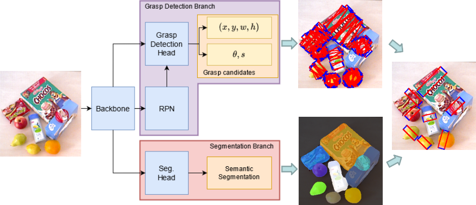

# End-to-end Trainable Deep Neural Network for Robotic Grasp Detection and Semantic Segmentation from RGB

[](https://paperswithcode.com/sota/robotic-grasping-on-cornell-grasp-dataset-1?p=end-to-end-trainable-deep-neural-network-for)


<p align="center">

<br>
<a href="https://arxiv.org/abs/2107.05287">arXiv</a>
</p>

This repository contains the code for the ICRA21 paper "End-to-end Trainable Deep Neural Network for Robotic Grasp Detection
and Semantic Segmentation from RGB". 
It contains the code for training and testing our proposed method in combination with the OCID_grasp dataset. 

If you use our method or dataset extension for your research, please cite:
```bibtex
@InProceedings{ainetter2021end,
  title={End-to-end Trainable Deep Neural Network for Robotic Grasp Detection and Semantic Segmentation from RGB},
  author={Ainetter, Stefan and Fraundorfer, Friedrich},
  booktitle={IEEE International Conference on Robotics and Automation (ICRA)},
  pages={13452--13458}
  year={2021}
}
```

## Requirements and setup

Main system requirements:
* CUDA 10.1
* Linux with GCC 7 or 8
* PyTorch v1.1.0

**IMPORTANT NOTE**: These requirements are not necessarily stringent, e.g. it might be possible to compile with older
versions of CUDA, or under Windows. However, we have only tested the code under the above settings and cannot provide support for other setups.

To install PyTorch, please refer to https://github.com/pytorch/pytorch#installation.

To install all other dependencies using pip:
```bash
pip install -r requirements.txt
```

### Setup

Our code is split into two main components: a library containing implementations for the various network modules,
algorithms and utilities, and a set of scripts to train / test the networks.

The library, called `grasp_det_seg`, can be installed with:
```bash
git clone https://github.com/stefan-ainetter/grasp_det_seg_cnn.git
cd grasp_det_seg_cnn
python setup.py install
```

## Trained models

The model files provided are made available under the [CC BY-NC-SA 4.0](https://creativecommons.org/licenses/by-nc-sa/4.0/) license.

A trained model for the OCID_grasp dataset can be downloaded [here](https://files.icg.tugraz.at/d/6b896fc59c4a48f98fe0/). 
Download and copy the downloaded weights into the `ckpt_files_OCID/pretrained` folder.

For re-training the network on OCID_grasp, you need to download weights pretrained on ImageNet 
[here](https://files.icg.tugraz.at/d/369dbea9ab834be1936b/) and copy them 
into the `weights_pretrained` folder.

### Training

Training involves three main steps: Preparing the dataset, creating a configuration file and running the training
script.

To prepare the dataset:
Download the OCID_grasp dataset [here](https://files.icg.tugraz.at/d/777515d0f6e74ed183c2/).
Unpack the downloaded `OCID_grasp.zip` file into the `DATA` folder.
The configuration file is a simple text file in `ini` format.
The default value of each configuration parameter, as well as a short description of what it does, is available in
[grasp_det_seg/config/defaults](grasp_det_seg/config/defaults).
**Note** that these are just an indication of what a "reasonable" value for each parameter could be, and are not
meant as a way to reproduce any of the results from our paper.

To launch the training:
```bash
cd scripts
python3 -m torch.distributed.launch --nproc_per_node=1 train_det_seg_OCID.py 
--log_dir=LOGDIR CONFIG DATA_DIR
```
Training logs, both in text and Tensorboard formats as well as the trained network parameters, will be written 
in `LOG_DIR` (e.g. `ckpt_files_OCID`).
The file `CONFIG` contains the network configuration e.g. `grasp_det_seg/config/defaults/det_seg_OCID.ini`, 
and `DATA_DIR` points to the previously downloaded OCID_grasp splits, e.g. `DATA/OCID_grasp/data_split`.

Note that, for now, our code **must** be launched in "distributed" mode using PyTorch's `torch.distributed.launch`
utility.

### Running inference

Given a trained network, inference can be run on any set of images using
[scripts/test_det_seg_OCID.py](scripts/test_det_seg_OCID.py):
```bash
cd scripts
python3 -m torch.distributed.launch --nproc_per_node=1 test_det_seg_OCID.py 
--log_dir=LOG_DIR CONFIG MODEL_PARAMS DATA_DIR OUTPUT_DIR

```
Predictions will be written to `OUTPUT_DIR` e.g. the `output` folder. `MODEL_PARAMS` are pre-trained weights e.g. `ckpt_files_OCID/pretrained/model_last.pth.tar`, 
`DATA_DIR` points to the used dateset splits e.g. `DATA/OCID_grasp/data_split`.

## OCID_grasp dataset
The OCID_grasp dataset can be downloaded [here](https://files.icg.tugraz.at/d/777515d0f6e74ed183c2/).
OCID_grasp consists of 1763 selected RGB-D images of the OCID dataset, with over 11.4k segmented object masks and more than 75k hand-annotated 
grasp candidates. Additionally, each object is classified into one of 31 object classes.
## Related Work
OCID_grasp is a dataset extension of the [OCID dataset](https://www.acin.tuwien.ac.at/en/vision-for-robotics/software-tools/object-clutter-indoor-dataset/).
If you decide to use OCID_grasp for your research, please also cite the OCID paper:
```bibtex
@inproceedings{suchi2019easylabel,
  title={EasyLabel: a semi-automatic pixel-wise object annotation tool for creating robotic RGB-D datasets},
  author={Suchi, Markus and Patten, Timothy and Fischinger, David and Vincze, Markus},
  booktitle={2019 International Conference on Robotics and Automation (ICRA)},
  pages={6678--6684},
  year={2019},
  organization={IEEE}
}
```
Our framework is based on the architecture from [Seamless Scene Segmentation](https://github.com/mapillary/seamseg):
```bibtex
@InProceedings{Porzi_2019_CVPR,
  author = {Porzi, Lorenzo and Rota Bul\`o, Samuel and Colovic, Aleksander and Kontschieder, Peter},
  title = {Seamless Scene Segmentation},
  booktitle = {The IEEE Conference on Computer Vision and Pattern Recognition (CVPR)},
  month = {June},
  year = {2019}
}
```
